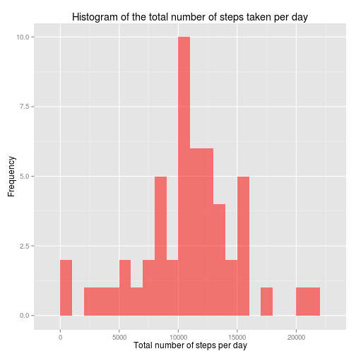
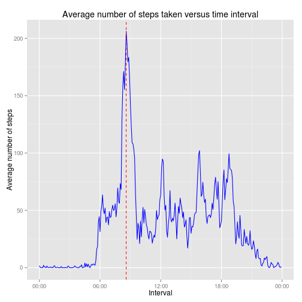
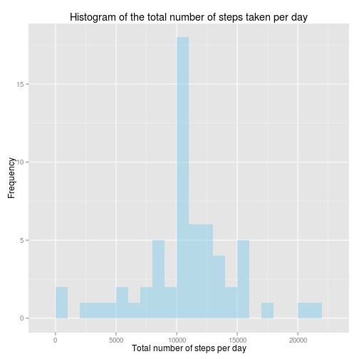
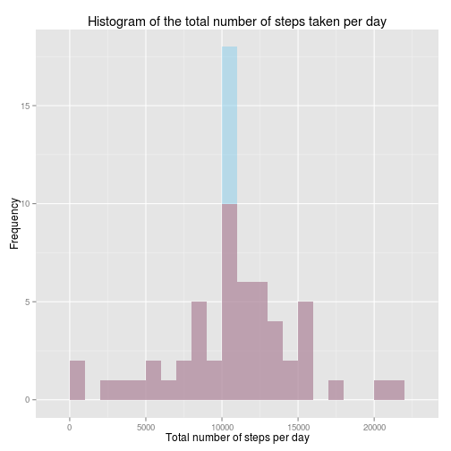
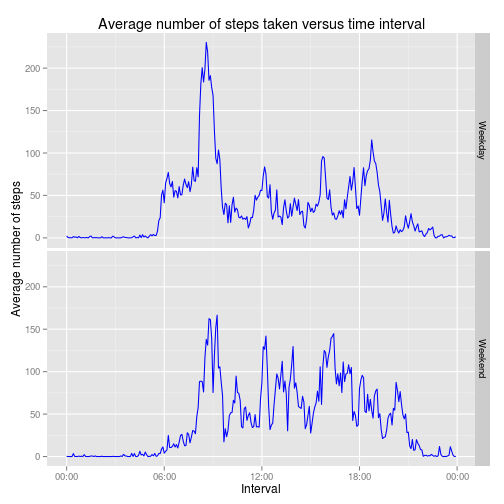

## Introduction

It is now possible to collect a large amount of data about personal
movement using activity monitoring devices such as a
[Fitbit](http://www.fitbit.com), [Nike
Fuelband](http://www.nike.com/us/en_us/c/nikeplus-fuelband), or
[Jawbone Up](https://jawbone.com/up). These type of devices are part of
the "quantified self" movement -- a group of enthusiasts who take
measurements about themselves regularly to improve their health, to
find patterns in their behavior, or because they are tech geeks. But
these data remain under-utilized both because the raw data are hard to
obtain and there is a lack of statistical methods and software for
processing and interpreting the data.

This assignment makes use of data from a personal activity monitoring
device. This device collects data at 5 minute intervals through out the
day. The data consists of two months of data from an anonymous
individual collected during the months of October and November, 2012
and include the number of steps taken in 5 minute intervals each day.

## Data

The data for this assignment can be downloaded from the course web
site:

* Dataset: [Activity monitoring data](https://d396qusza40orc.cloudfront.net/repdata%2Fdata%2Factivity.zip) [52K]

The variables included in this dataset are:

* **steps**: Number of steps taking in a 5-minute interval (missing
    values are coded as `NA`)

* **date**: The date on which the measurement was taken in YYYY-MM-DD
    format

* **interval**: Identifier for the 5-minute interval in which
    measurement was taken


The dataset is stored in a comma-separated-value (CSV) file and there
are a total of 17,568 observations in this
dataset.


## Loading and preprocessing the data

First, I start by setting this global option that makes all my code visible (the other options turn off package loading messages and warnings):

```r
# Load the knitr library to set globals:
require(knitr)
opts_chunk$set(echo = TRUE, message = FALSE, warning = FALSE)
```

The assignment instructions contain the following note:

*The GitHub repository also contains the dataset for the assignment so you do not have to download the data separately.*

Therefore, we only need to unzip and read the data (optionally, we check that this worked by inspecting the first few records and also the types of the data):


```r
unzip("activity.zip", files="activity.csv")
activity <- read.csv("activity.csv")
head(activity)
```

```
##   steps       date interval
## 1    NA 2012-10-01        0
## 2    NA 2012-10-01        5
## 3    NA 2012-10-01       10
## 4    NA 2012-10-01       15
## 5    NA 2012-10-01       20
## 6    NA 2012-10-01       25
```

```r
str(activity)
```

```
## 'data.frame':	17568 obs. of  3 variables:
##  $ steps   : int  NA NA NA NA NA NA NA NA NA NA ...
##  $ date    : Factor w/ 61 levels "2012-10-01","2012-10-02",..: 1 1 1 1 1 1 1 1 1 1 ...
##  $ interval: int  0 5 10 15 20 25 30 35 40 45 ...
```

We then transform the data in the "date" column (which are factors, as seen above) into dates:


```r
activity <- transform(activity, date = as.Date(date))
str(activity)
```

```
## 'data.frame':	17568 obs. of  3 variables:
##  $ steps   : int  NA NA NA NA NA NA NA NA NA NA ...
##  $ date    : Date, format: "2012-10-01" "2012-10-01" ...
##  $ interval: int  0 5 10 15 20 25 30 35 40 45 ...
```


## What is mean total number of steps taken per day?

The assignment says: *For this part of the assignment, you can ignore the missing values in the dataset.* 

Therefore we shall create a new data frame with the `NA` values removed:


```r
activity.NoNAs <- activity[complete.cases(activity),]
```

The total number of steps taken per day is calculated thus:

```r
totalStepsPerDay <- aggregate(steps ~ date, activity.NoNAs, sum)
```

1. Histogram of the total number of steps taken per day:

```r
# I like pretty plots. Let's load ggplot2:
require(ggplot2)
g <- ggplot(totalStepsPerDay, aes(x=steps)) +
  geom_histogram(alpha=0.5, fill="red", binwidth=1000,position='identity') +
  ylab("Frequency") + xlab("Total number of steps per day") +
  ggtitle("Histogram of the total number of steps taken per day")
g
```

 

2. Mean and median total number of steps taken per day:

```r
mean(totalStepsPerDay$steps)
```

```
## [1] 10766
```

```r
median(totalStepsPerDay$steps)
```

```
## [1] 10765
```

## What is the average daily activity pattern?

The average number of steps taken per interval, averaged across all days, is calculated thus:

```r
averageStepsPerInterval <- aggregate(steps ~ interval, activity, mean)
```
(Note: `NA` values have not been removed, as there no indication in the assignment instructions that this is required.)

Having noticed that the "interval" column is simply a 24-hour clock representation of the time when the measurements were taken, we can optionally transform the data in the "interval" column into times:

```r
# Firstly, transform the interval data (integers) into characters padded with leading zeros as needed:
averageStepsPerInterval$time <- formatC(averageStepsPerInterval$interval, width = 4, format = "d", flag = "0")
# Next, convert the character representation of the time into an actual time:
averageStepsPerInterval$time <- strptime(averageStepsPerInterval$time, format = "%H%M")
str(averageStepsPerInterval)
```

```
## 'data.frame':	288 obs. of  3 variables:
##  $ interval: int  0 5 10 15 20 25 30 35 40 45 ...
##  $ steps   : num  1.717 0.3396 0.1321 0.1509 0.0755 ...
##  $ time    : POSIXlt, format: "2014-11-14 00:00:00" "2014-11-14 00:05:00" ...
```
The date information is incorrect, but we won't be using it to construct our plot.

1. A time series plot of the average number of steps taken, averaged over all days, versus the 5-minute interval:

```r
# We'll need the following library for handling times:
require(scales)
g <- ggplot(averageStepsPerInterval, aes(x = time, y = steps)) +
  geom_line(colour = "blue") +
  scale_x_datetime(labels = date_format("%H:%M")) +
  xlab("Interval") +
  ylab("Average number of steps") +
  ggtitle("Average number of steps taken versus time interval") + 
  geom_vline(xintercept = as.numeric(as.POSIXct(
    averageStepsPerInterval[which.max(averageStepsPerInterval$steps), "time"]
    )), color = "red", linetype = "dashed")
g
```

 

2.  The 5-minute interval, on average across all the days in the dataset, containing the maximum number of steps is calculated thus:

```r
maxStepsInterval <- averageStepsPerInterval[which.max(averageStepsPerInterval$steps), "interval"]
maxStepsInterval
```

```
## [1] 835
```
This interval is indicated with the red vertical dashed line on the previous plot. This value is expressed as an integer count of the number of minutes since the start of the day. We can, instead, express this value as a time:


```r
maxStepsInterval <- averageStepsPerInterval[which.max(averageStepsPerInterval$steps), "time"]
format(maxStepsInterval, "%H:%M")
```

```
## [1] "08:35"
```
## Imputing missing values

1. The total number of rows with `NA` values:

```r
sum(is.na(activity))
```

```
## [1] 2304
```

2. To impute values, we're going to use the number of steps taken per interval, averaged over all days:

```r
# Calculate the number of steps per interval averaged over all days; this is the replacement data:
replacements <- aggregate(steps ~ interval, activity, mean, na.action = na.omit)$steps
```

3. Create a new dataset that is equal to the original dataset but with the missing data filled in:

```r
activity.imputed <- transform(activity, steps = ifelse(is.na(activity$steps), replacements, activity$steps))
```

How many `NA` values are in the imputed data?

```r
sum(is.na(activity.imputed))
```

```
## [1] 0
```

Inspect the data, recalling that the first few rows of the data previously held `NA` values:

```r
head(activity.imputed)
```

```
##     steps       date interval
## 1 1.71698 2012-10-01        0
## 2 0.33962 2012-10-01        5
## 3 0.13208 2012-10-01       10
## 4 0.15094 2012-10-01       15
## 5 0.07547 2012-10-01       20
## 6 2.09434 2012-10-01       25
```

4. Calculate the total number of steps taken per day with our new data frame:

```r
totalStepsPerDay.imputed <- aggregate(steps ~ date, activity.imputed, sum)
```

Histogram of the total number of steps taken per day:

```r
g <- ggplot(totalStepsPerDay.imputed, aes(x=steps)) +
  geom_histogram(alpha=0.5, fill="skyblue", binwidth=1000,position='identity') +
  ylab("Frequency") + xlab("Total number of steps per day") +
  ggtitle("Histogram of the total number of steps taken per day")
g
```

 

Mean and median total number of steps taken per day:

```r
mean(totalStepsPerDay.imputed$steps)
```

```
## [1] 10766
```

```r
median(totalStepsPerDay.imputed$steps)
```

```
## [1] 10766
```

We see that:

- the mean calculated with the data containing imputed values is the same as the mean calculated with the data containing `NA` values,

- the median calculated with the data containing imputed values is slightly higher than the median calculated with the data containing `NA` values,

- the mean and the median are now equal.

If on the same axes we plot the histograms of the total number of steps taken per day for both the imputed and the non-imputed data, we see that the effect of imputing `NA` values is to increase the number of entries in the centre of the range (red = original data, blue = imputed data; mauve = red + blue, with transparency).

```r
g <- ggplot(totalStepsPerDay, aes(x=steps)) +
  geom_histogram(data = totalStepsPerDay, alpha=0.5, fill="red", binwidth=1000,position='identity') +
  geom_histogram(data = totalStepsPerDay.imputed, alpha=0.5, fill="skyblue", binwidth=1000,position='identity') +
  ylab("Frequency") + xlab("Total number of steps per day") +
  ggtitle("Histogram of the total number of steps taken per day")
g
```

 


*The impact of imputing missing data is that the estimates of the total daily number of steps increases.*


## Are there differences in activity patterns between weekdays and weekends?

Firstly, create a new variable that is the weekday of the date, then check to see if it begins with the letter 's'; this is sufficient to find all the days that fall on a weekend:

```r
activity.imputed$day <- weekdays(activity.imputed$date)
# Does the day begin with an 's'?
activity.imputed$isWeekend <- grepl("^S", activity.imputed$day)
activity.imputed$dayType <- factor(activity.imputed$isWeekend, levels = c(F, T), labels = c("Weekday", "Weekend"))
head(activity.imputed)
```

```
##     steps       date interval    day isWeekend dayType
## 1 1.71698 2012-10-01        0 Monday     FALSE Weekday
## 2 0.33962 2012-10-01        5 Monday     FALSE Weekday
## 3 0.13208 2012-10-01       10 Monday     FALSE Weekday
## 4 0.15094 2012-10-01       15 Monday     FALSE Weekday
## 5 0.07547 2012-10-01       20 Monday     FALSE Weekday
## 6 2.09434 2012-10-01       25 Monday     FALSE Weekday
```

```r
str(activity.imputed)
```

```
## 'data.frame':	17568 obs. of  6 variables:
##  $ steps    : num  1.717 0.3396 0.1321 0.1509 0.0755 ...
##  $ date     : Date, format: "2012-10-01" "2012-10-01" ...
##  $ interval : int  0 5 10 15 20 25 30 35 40 45 ...
##  $ day      : chr  "Monday" "Monday" "Monday" "Monday" ...
##  $ isWeekend: logi  FALSE FALSE FALSE FALSE FALSE FALSE ...
##  $ dayType  : Factor w/ 2 levels "Weekday","Weekend": 1 1 1 1 1 1 1 1 1 1 ...
```

Average over all days, then add the timestamp so that we can make fancy time series plots with appropriate labels on the x-axis:

```r
averageStepsPerInterval.imputed <- aggregate(steps ~ interval + dayType, activity.imputed, mean)
# Firstly, transform the interval data (integers) into characters padded with leading zeros as needed:
averageStepsPerInterval.imputed$time <- formatC(averageStepsPerInterval.imputed$interval, width = 4, format = "d", flag = "0")
# Next, convert the character representation of the time into an actual time:
averageStepsPerInterval.imputed$time <- strptime(averageStepsPerInterval.imputed$time, format = "%H%M")
```

Make the plot:

```r
g <- ggplot(averageStepsPerInterval.imputed, aes(x = time, y = steps)) +
  facet_grid(dayType ~ .) +
  geom_line(colour = "blue") +
  scale_x_datetime(labels = date_format("%H:%M")) +
  xlab("Interval") +
  ylab("Average number of steps") +
  ggtitle("Average number of steps taken versus time interval") 
g
```

 


The plot shows that there is a clear difference between weekend and weekday activity patterns. On weekdays, this subject's average level of activity rises abruptly from rest just before 6am (alarm clock wakes up the subject?). Activity levels are then moderate (the subject is getting ready for work?) until around 8am, spiking at 8:35am (perhaps the subject is rushing to get to work on time?). Activity levels fall at around 9am. The general level of activity on a weekday from 9am until the evening is lower than for the same period of time on a weekend (perhaps this subject has a sedentary job in an office, not moving from their desk much?). On weekdays, this subject's activity levels decline earlier than on a weekend (this subject appears to go to bed earlier on a weekend). On weekends, this subject's activity levels rise from a resting state later in the day than on weekends, and the change is less abrupt (no early morning panic to get to work on time!). However, activity levels are generally higher throughout the day than on a weekday (the subject engages in leisure activities?).
